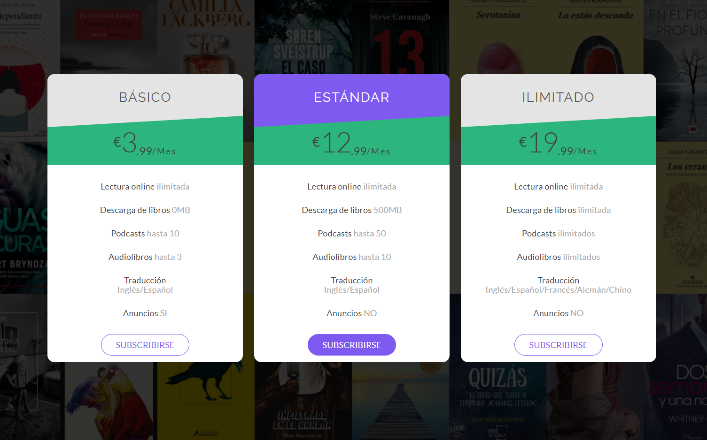
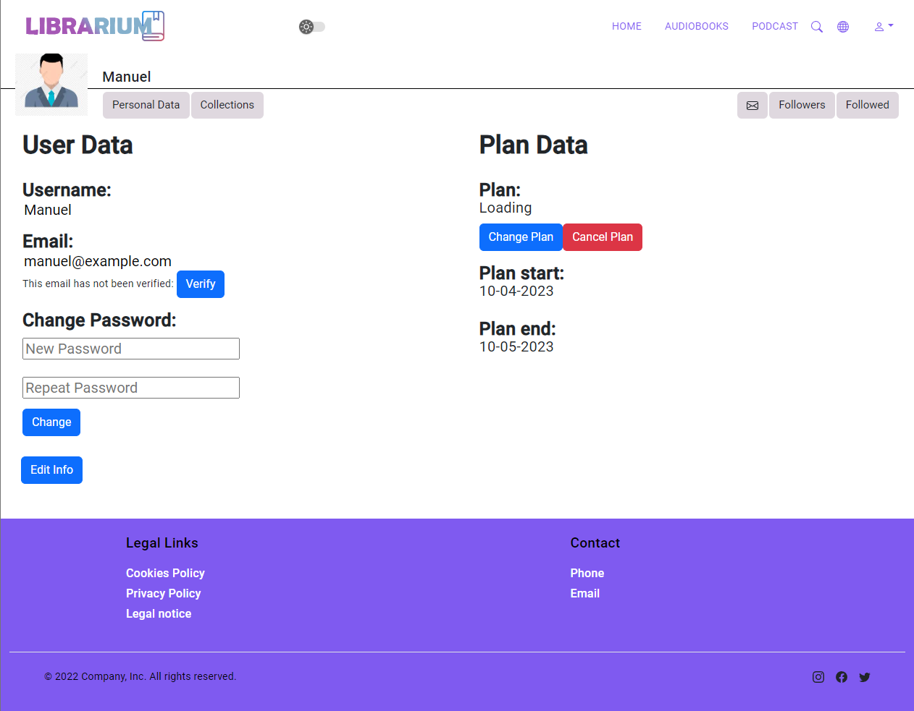

<h1 align="center"></h1>


<p align="center"> 
  
 
 


</p>

<p>LIBRARIUM es un proyecto que utiliza las tecnologías Angular y Firebase para brindar a los usuarios una experiencia completa de lectura online y reproducción de audiolibros a través de una suscripción. Esta plataforma innovadora y accesible permite a los usuarios disfrutar de una amplia selección de libros electrónicos y audiolibros, actuando a su vez como una red social para lectores.</p> 


## Contenido
<div>

  <h3>1.Presentación</h3>
  <h3>2.Funciones</h3>
  <h3>3.Ejecución</h3>
  <h3>4.Notas</h3>
 
</div>

## Presentación

### Inicio

<p align="center">
     
</p>

### Registro/Logueo
<p align="center">
     
</p>

### Lectura libro
<p align="center">
     
</p>


### Reproducción audiolibro
<p align="center">
     
</p>


### Perfil
<p align="center">
     
</p>

## Funciones
  <li>Función de logueo y registro/suscripción utilizando <strong>Stripe</strong></li>
  <li>Función de lectura de libros online</li>
  <li>Función de reproducción de audiolibros</li>
  <li>Función de administración de perfil</li>
  <li>Función de modo administrador</li>

## Ejecución
### Pasos:

  #### Clonar Repositorio
  ```
  git clone https://github.com/AcoranGonzalezMoray/ServicioBibliotecaOnline.git
  ```

  #### Instalar dependencias del proyecto
  ```
  npm install
  ```
 
 #### Ejecutar proyecto angular
  ```
  ng serve -o
  ```


## Notas
Este proyecto ha sido desarrollado utilizando los siguientes frameworks:

<strong>Angular:</strong> Un potente framework de JavaScript para construir aplicaciones web de una sola página (SPA). Proporciona una estructura sólida y herramientas eficientes para el desarrollo de interfaces de usuario interactivas. Pincha <a href="https://angular.io/">aquí</a> para más información.

<strong>Stripe:</strong> Una plataforma de pagos en línea que facilita la integración de funciones de pago en aplicaciones web. Stripe ofrece una API sencilla y segura para procesar transacciones con tarjetas de crédito y otros métodos de pago. Pincha <a href="https://stripe.com/es">aquí</a> para más información.

<strong>Firebase:</strong> Una plataforma de desarrollo de aplicaciones móviles y web que ofrece una amplia gama de servicios y herramientas, incluyendo almacenamiento en la nube, autenticación de usuarios, bases de datos en tiempo real, alojamiento web y más. En este proyecto, Firebase se ha utilizado para el almacenamiento de datos y la autenticación de usuarios. Pincha <a href="https://firebase.google.com/">aquí</a> para más información.

Estos frameworks han sido seleccionados por su robustez, eficiencia y popularidad en el desarrollo de aplicaciones web modernas. Han contribuido significativamente a la creación de este proyecto, proporcionando una base sólida y funcionalidades clave para su funcionamiento.

Para obtener más información sobre cómo utilizar estos frameworks en el proyecto, consulta la documentación oficial de cada uno de ellos.
